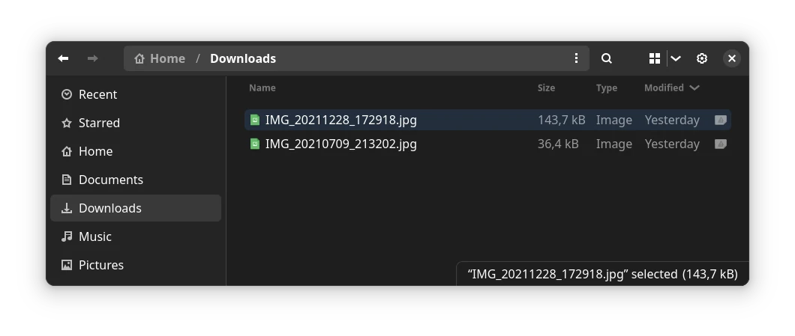

# Another way to view photos on a map

Behind this solution is the location of the photo on a map based on its GPS metadata and the ability to add information about it afterwards.

## A use case

Let's suppose we have some photos of a trip

and we want to add information to have in the future.

As we can see in the animation below, the information will be saved in a [GeoJSON](https://geojson.org/) file for later use.

https://github.com/migupl/where-was-the-photo-taken/assets/1670474/ae540af7-3a8e-4dd9-bc30-d59f51d55c3b

The name for the saved file will be the text of the main input field. *Madrid trip* in this example.

If the browser supports the showSaveFilePicker() method of the Window interface, such as Chrome, you could choose the folder where the GeoJSON will be saved.

Then, by adding this GeoJSON file and the photos we can continue adding information to them as we can see below

https://github.com/migupl/where-was-the-photo-taken/assets/1670474/0f442c0f-e4e4-4147-8ba6-bf7d749d901b

We can always add new photos, but only one GeoJSON file.

## Manually add a marker to the map

Add a marker is done clicking with the right button in any point of the map. This action opens a popup with a button for confirmation.

This marker will be draggable.

https://github.com/migupl/where-was-the-photo-taken/assets/1670474/4b8ce691-5d9c-4014-89bc-1787dc64baaa

## Remove a marker from the map

Any of the markers added to the map can be deleted by double clicking on it and confirming the deletion.

https://github.com/migupl/where-was-the-photo-taken/assets/1670474/eecc83b4-5137-421f-bd50-0bab800fac09

## Helpers

A [container is used for hot reloading](https://github.com/migupl/hot-reloading-container) during development.

Web Components behind this idea are:
- [Dropping a photo and getting EXIF data](https://github.com/migupl/drop-photo-get-exif-data)
- [Locate the photo on a Leaflet map](https://github.com/migupl/vanilla-js-web-component-leaflet-geojson)
- [Yet Another GitHub Corner](https://github.com/migupl/yagc)

